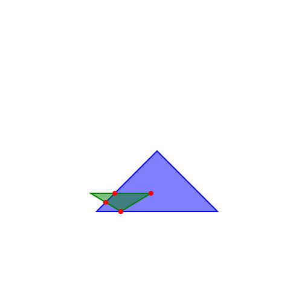

# Triangle Intersections

Программа на C++, вычисляющая геометрическое пересечение двух треугольников: находит все точки, где границы фигур пересекаются, а также вершины одного треугольника, лежащие внутри другого.



## Как это работает

Пересечение двух треугольников (`polygon::operator*`) складывается из трёх частей:

1. **Пересечения рёбер** — перебор всех пар рёбер обоих треугольников, поиск точки пересечения прямых через нормали, с проверкой, что точка лежит в пределах обоих отрезков.
2. **Вершины первого треугольника внутри второго** и наоборот — реализовано через классический алгоритм **ray casting** (проверка попадания точки в многоугольник).
3. Результат сохраняется в новый `polygon` и экспортируется в SVG-картинку (`PolyToSVG`) для визуальной проверки.

## Структура проекта

| Файл | Назначение |
|---|---|
| `polygon.h` / `polygon.cpp` | Класс `polygon`: хранение точек, пересечение фигур |
| `SVG.h` / `SVG.cpp` | Экспорт результата в SVG-файл |
| `main.cpp` | Точка входа, создание тестовых фигур |
| `CMakeLists.txt` | Сборка через CMake |

## Сборка

**Через CMake:**
```bash
cmake -B build
cmake --build build
```

**Через Code::Blocks:** откройте `Polygon(triangle).cbp` и нажмите Build and Run (F9).

## Известные ограничения

- Работает только с треугольниками (три точки на фигуру).
- Буфер результата пересечения — 6 точек, что является точной верхней границей числа вершин
  пересечения двух выпуклых треугольников (m + n вершин для многоугольников с m и n вершинами).
  Единственный неучтённый случай — совпадающие (накладывающиеся) стороны треугольников: тогда
  пересечение представляет собой непрерывный отрезок, а не конечный набор точек, и требует
  отдельной обработки.
